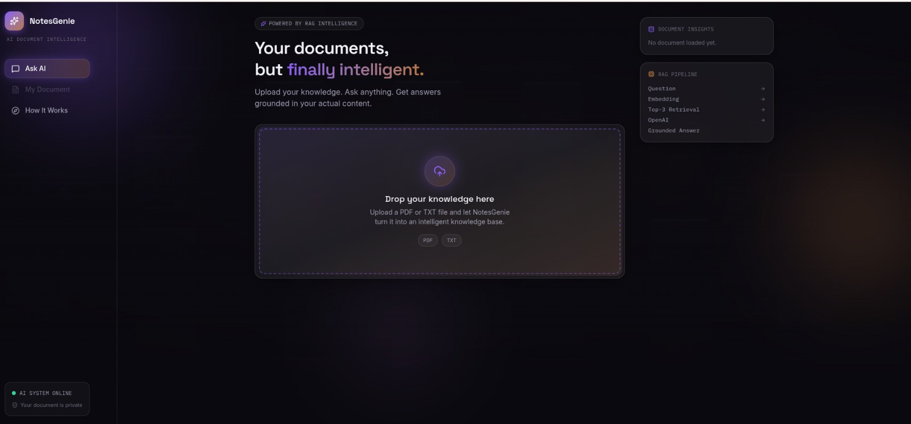
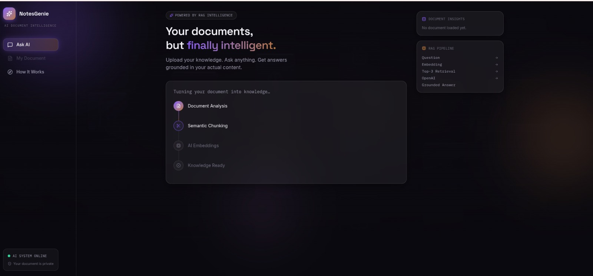

# NotesGenie
AI Engineering Internship — Task 3 | ProStackHub

A single-document AI Q&A tool. Upload a PDF or TXT file, ask questions about it, and get answers grounded strictly in that document's content — with full transparency into which chunks were used to generate each answer.

Built as Task 3 for the AI Engineering internship track.

🔗 Live Demo: notesgenie-app-2026-d4dfgub8andeebhp.canadacentral-01.azurewebsites.net

## Features

- Upload a single PDF or TXT document
- Automatic text extraction, chunking, and embedding
- Ask natural-language questions about the document
- Answers are grounded **only** in retrieved content — no hallucinated facts
- Every answer shows its **source chunks** (chunk ID + relevance score), for full transparency
- Clear handling of edge cases: empty files, unsupported formats, unrelated questions, missing uploads
- Responsive, polished UI (desktop, tablet, mobile)


## Architecture Overview

NotesGenie follows a standard **Retrieval-Augmented Generation (RAG)** architecture, split into two phases:

**Indexing (runs once, on upload):**
```
Upload → Extract Text → Chunk (~500 tokens, 50 overlap) → Embed (OpenAI) → Store (ChromaDB)
```

**Answering (runs on every question):**
```
Question → Embed Question → Retrieve Top-3 Chunks → Build Context → OpenAI Chat Model → Grounded Answer + Sources
```

The backend is a stateless FastAPI service. ChromaDB persists document chunks and their embeddings to disk. Since this is a single-document tool, each new upload resets the vector store before indexing the new file.

For a deeper technical write-up, see [`ARCHITECTURE.md`](./ARCHITECTURE.md).

## Technology Stack

**Backend**
- Python, FastAPI, Uvicorn
- OpenAI API (`text-embedding-3-small` for embeddings, `gpt-4o-mini` for answer generation)
- ChromaDB (vector store)
- pypdf (PDF text extraction)
- Pydantic / pydantic-settings
- `uv` (dependency and environment management)

**Frontend**
- React + Vite
- Tailwind CSS
- Framer Motion (animations)
- Lucide React (icons)
- Axios (API communication)

> **Note on the original task spec:** the assignment brief referenced Google's `text-embedding-004` and Gemini's chat model. `text-embedding-004` has since been deprecated by Google, so this project uses OpenAI's `text-embedding-3-small` and `gpt-4o-mini` instead, with sign-off from the internship supervisor. ChromaDB was chosen over FAISS — both were listed as acceptable options in the brief.


## RAG Pipeline in Detail

1. **Upload** — a single `.pdf` or `.txt` file is accepted and validated.
2. **Extraction** — text is pulled from every page (PDF) or read directly (TXT).
3. **Chunking** — text is split into ~500-token chunks with a 50-token overlap, so no sentence is lost at a chunk boundary.
4. **Embedding** — each chunk is converted into a 1536-dimension vector via OpenAI's `text-embedding-3-small`.
5. **Storage** — vectors and their source text are stored in a ChromaDB collection (cosine similarity).
6. **Retrieval** — on each question, the question is embedded the same way, and the top 3 most similar chunks are retrieved.
7. **Grounded generation** — the retrieved chunks are inserted into a strict system prompt instructing the model to answer only from that context, or say the answer isn't available.
8. **Transparency** — the response includes the retrieved chunks (ID, text, similarity score) alongside the answer.


## Folder Structure

```
notesgenie/
├── backend/
│   ├── app/
│   │   ├── api/routes/       # upload.py, chat.py — HTTP endpoints
│   │   ├── services/         # document, chunking, embedding, vector store, RAG logic
│   │   ├── schemas/          # Pydantic request/response models
│   │   ├── core/             # config.py — environment settings
│   │   └── main.py           # FastAPI app entrypoint
│   ├── data/
│   │   ├── uploads/          # uploaded documents (gitignored)
│   │   └── chroma_db/        # ChromaDB persistence (gitignored)
│   ├── tests/                # pytest test suite
│   ├── pyproject.toml
│   └── .env.example
│
├── frontend/
│   ├── src/
│   │   ├── api/               # notesApi.js — Axios API layer
│   │   ├── components/
│   │   │   ├── layout/         # Sidebar, Header, MobileTopBar
│   │   │   ├── ui/             # GlassCard, GradientButton, AnimatedBackground, StatusDot
│   │   │   ├── upload/         # UploadZone, DocumentCard, ProcessingPipeline, UploadFlow
│   │   │   ├── chat/           # ChatInterface, ChatMessage, QuestionInput, SourceCard, SuggestedQuestions
│   │   │   └── panels/         # IntelligencePanel, DocumentView, HowItWorks
│   │   ├── hooks/              # useNotesGenie.js — shared app state
│   │   └── App.jsx
│   └── .env.example
│
├── README.md
└── ARCHITECTURE.md
```

## Local Setup

### Prerequisites
- Python 3.11+
- Node.js 18+
- [`uv`](https://docs.astral.sh/uv/) installed
- An OpenAI API key

### Environment Variables

**`backend/.env`**
```
OPENAI_API_KEY=your_openai_api_key_here
```

**`frontend/.env`**
```
VITE_API_BASE_URL=http://127.0.0.1:8000/api
```

Copy the corresponding `.env.example` file in each folder and fill in real values. Never commit `.env` files.

### Run the Backend

```bash
cd backend
uv sync
uv run uvicorn app.main:app --reload --port 8000
```

The API will be available at `http://127.0.0.1:8000`, with interactive docs at `http://127.0.0.1:8000/docs`.

### Run the Frontend

```bash
cd frontend
npm install
npm run dev
```

The app will be available at `http://localhost:5173`. Make sure the backend is running at the same time.


| Method | Endpoint | Description |
|---|---|---|
| GET | `/health` | Health check |
| POST | `/api/upload` | Upload and index a PDF/TXT |
| POST | `/api/ask` | Ask a question about the uploaded document |
### Example: Upload

```bash
curl -X POST http://127.0.0.1:8000/api/upload \
  -F "file=@sample.pdf"
```

```json
{
  "filename": "sample.pdf",
  "file_type": ".pdf",
  "size_bytes": 48213,
  "character_count": 12044,
  "text_preview": "This document discusses...",
  "message": "File uploaded and processed successfully into 6 chunks."
}
```

### Example: Ask

```bash
curl -X POST http://127.0.0.1:8000/api/ask \
  -H "Content-Type: application/json" \
  -d '{"question": "What is this document about?"}'
```

```json
{
  "answer": "The document discusses...",
  "sources": [
    { "chunk_id": 0, "content": "...", "score": 0.83 },
    { "chunk_id": 4, "content": "...", "score": 0.71 }
  ]
}
```

## Screenshots
 1. Document Upload


  
   2. Document Processing



  3. AI Chat & Source Transparency


|
## Known Limitations

- Supports a single document at a time — uploading a new file replaces the previous one.
- No persistent chat history — conversation is lost on page refresh (by design, out of scope for this task).
- No OCR — scanned (image-only) PDFs with no selectable text cannot be processed.
- No user authentication or multi-user support.
- Source citations are at the chunk level, not the page level.

## Future Improvements

- OCR support for scanned documents
- Multi-document support with document switching
- Streaming answers (token-by-token)
- Optional conversation memory within a session
- `.docx` support


## Author

Fatima Habib

AI Engineering Intern — ProStackHub

This project was developed as **Task 3** of the Artificial Intelligence Engineering Internship Program at ProStackHub.
